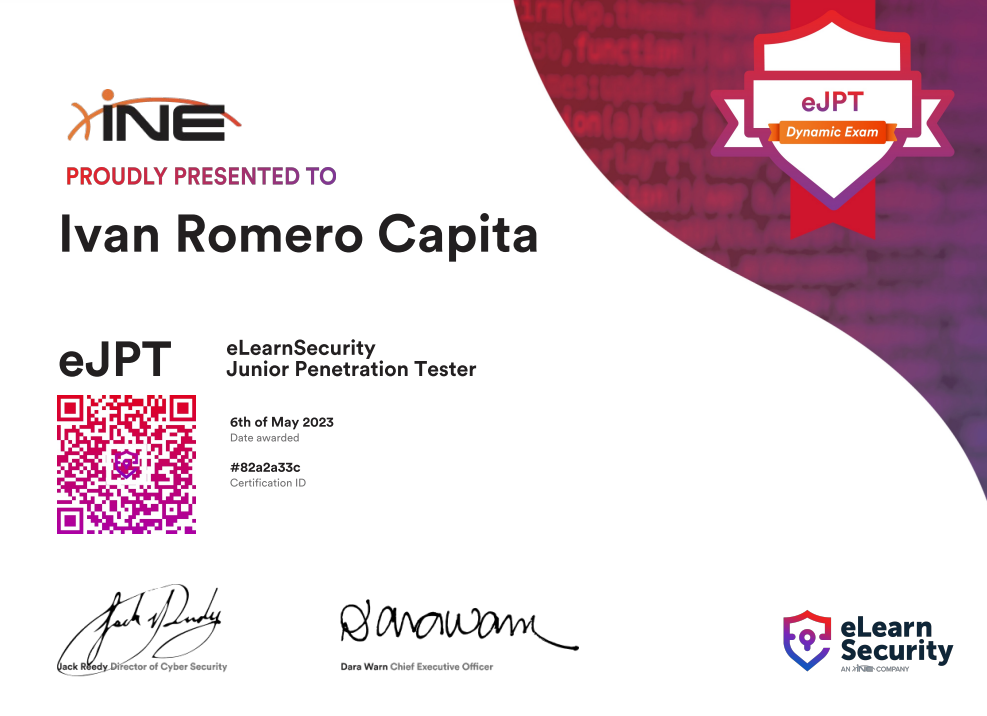

¡Hola a todos!, hace una semana hice el examen de eLearnSecurity y vengo a contaros mi experiencia en cuanto a dificultad y contenidos.

 

## ¿Vale la pena?

Si estás iniciándote el mundo del pentesting como yo, te diría que si, a mi me ha servido mucho, porque al ser el primer examen al que me presento iba con miedo debido a qué no sabia a que me enfrentaba y así ya me puedo ir haciendo una idea.
Yo no hice el curso de INE, tengo hecha una considerable batería de máquinas de TryHackMe y HackTheBox , además de estar cursando un Bootcamp que me ha permitido adquirir los conocimientos correspondientes de redes, Linux y Windows.
Por este motivo yo recomendaría hacer el curso para poder realizar el examen con éxito, ya que se dan temas importantes para dicha prueba, aunque para acelerar el proceso puedes omitir los módulos de programación, puesto que el examen no se centra demasiado en esa parte.

## ¿Cómo definirías su dificultad?

En mi opinión el examen me ha resultado fácil, pero hay que tener muy en cuenta la organización y saber enumerar muy bien, te puedes abrumar si no llevas una organización correcta.
El examen tiene una duración de 48 horas y tienes tiempo de sobra para hacerle, por lo tanto no hay prisa , debes ir con calma y apuntando todo lo que ves, eso es lo más importante.
El examen es en un navegador sin conexión, por lo tanto no puedes instalar herramientas.

## ¿Qué repasar para ese momento?

Los temas que puedes abarcar son los siguientes:

- IP route (con metasploit también)
- Wireshark
- Host Discovery
- Fuzzing
- Fuerza bruta
- Explotación Básica
- SQLi
- XSS
- Burpsuite
- Metasploit 
- Redes
- Fundamentos Linux/Windows

## ¿Cómo es el examen?

El examen está compuesto por 35 preguntas, 30 de ellas son tipo test, las demás suelen ser preguntas cortas que se responden a medida que se va haciendo el examen.

## Tips

- No es un CTF, a mí me pasó varias veces y pensé en lo difícil, pero es mucho más fácil.

- Busca siempre dos formas de hacer las cosas para que no se te escape nada.

- Se puede usar cualquier herramienta automática, ya que no están prohibidas.

## Máquinas que pueden ser útiles para practicar:

- Vulnet Internal (THM)
- Game Zone (THM)
- ColddBox (THM)
- Cap (HTB)
- Validation (HTB)
- Wekor (Sin escalada) (THM)
- Blog (THM)
